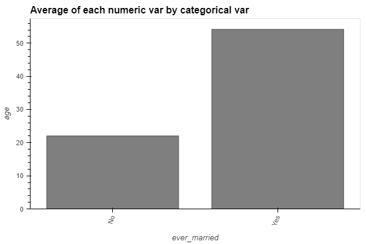

# EDA findings

Here we will be pointing out some finding that we found around our analysis in the sample
1. **Age and Stroke:** 
   - The data suggests a possible correlation between age and stroke incidence, with higher rates occurring in individuals above 40. However, it's crucial to explore this relationship further using statistical tests to determine the strength and significance of the association. Age might be a confounding variable influencing both stroke risk and marital status. We need to control for age when analyzing the relationship between marital status and stroke.
   - 
2. **Marital Status and Stroke:** 
   - The initial observation suggests a difference in stroke risk between married and non-married individuals. However, it's important to consider confounding factors like socioeconomic status or health behaviors that might explain this difference. Further analysis is needed to isolate the true effect of marital status on stroke risk.
   - 
3. **KDE Plot and Age:**
   - The KDE plot visually highlights the potential age distribution difference between those with and without stroke history. Statistical tests can quantify this difference and assess its significance.
   - 
4. **Heatmap and Variable Correlation:** 
   - The heatmap suggests a lack of strong correlations between most variables. However, it's important to use appropriate statistical measures (e.g., correlation coefficients) to confirm this observation and explore potential non-linear relationships between variables.
   - 
5. **Age and Marital Status:**
   - The initial observation suggests a connection between age and marital status. This might be due to age being a confounding variable.  Further analysis is needed to understand the independent effects of age and marital status on stroke risk.
   - 
6. **Glucose Levels and Stroke:**
   - The data indicates a possible link between higher glucose levels and increased stroke risk. However, this observation needs to be confirmed with statistical tests and controlling for other relevant factors like weight or diabetes diagnosis.
   - 

Additional Considerations:

Investigate potential interactions between variables. for that we will be analysing them using statistical analysis to see if we could get more insights about the sample that we already had.