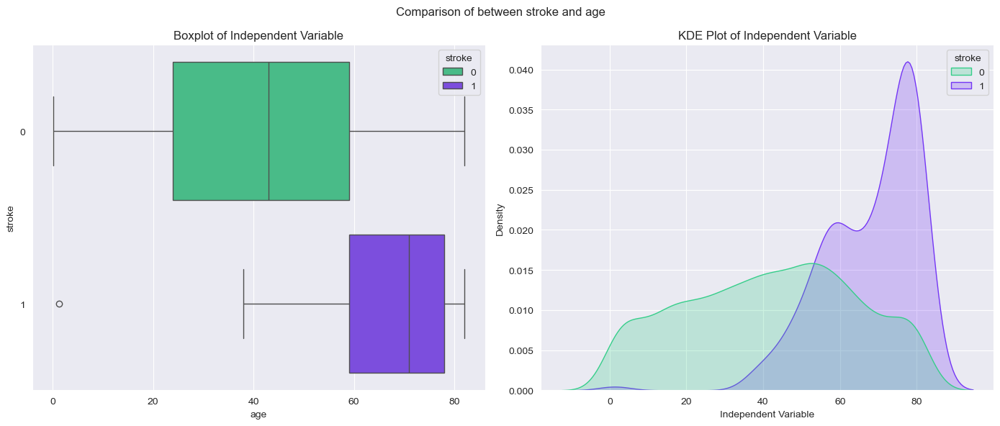
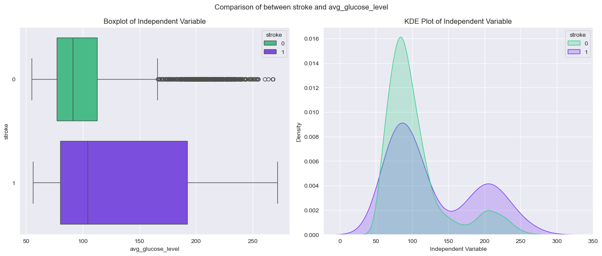
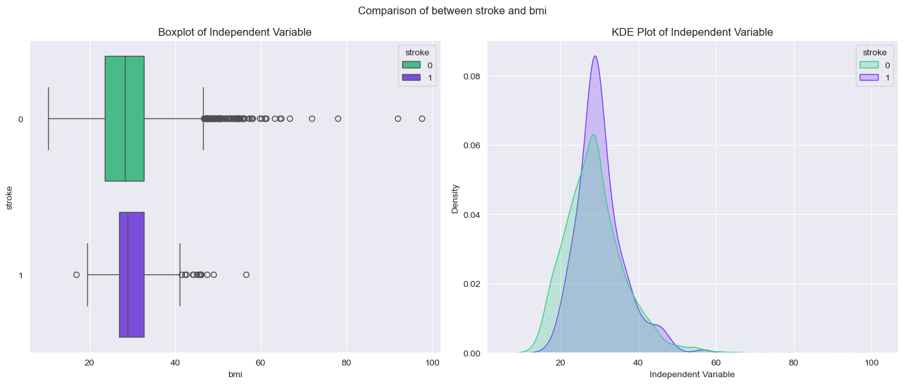
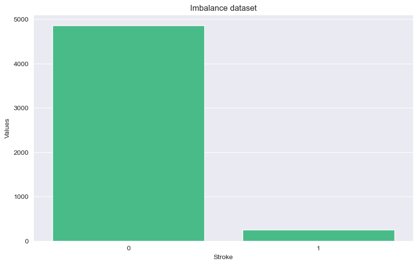
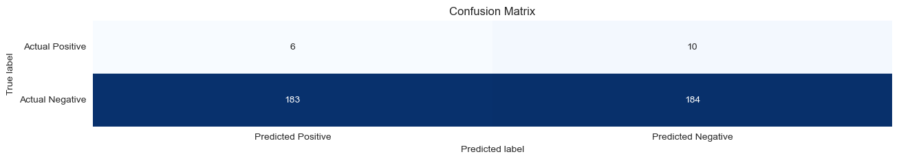
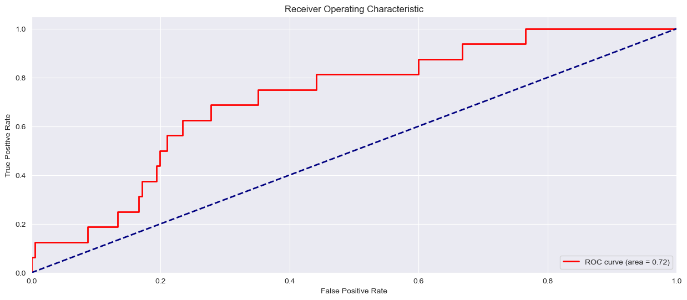
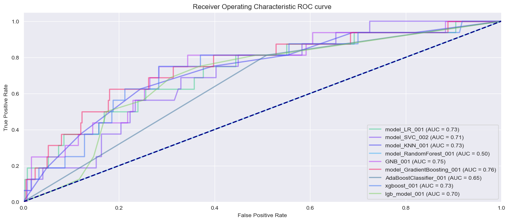
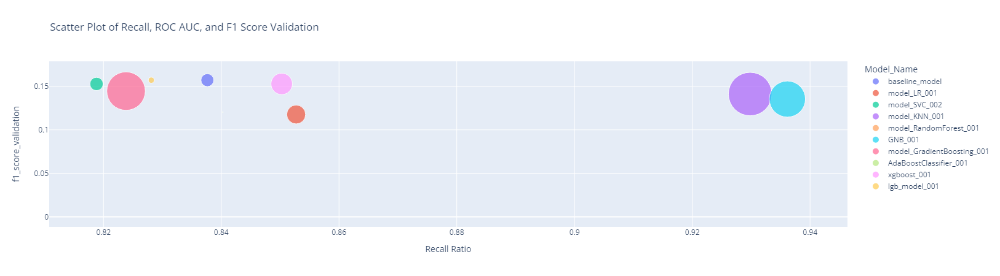

### Table of Contents
1. [Inferential analysis](#Inferential_analysis)
2. [Modeling](#Modeling)

# Inferential_analysis

Now we will be describing the results of each of the questions we are trying to answer in that notebook

## Is there a significant association between one or more categorical variables and the likelihood of having a stroke?

### Null Hypothesis (H0): There is association between stroke and the other categories, so they are independent
### Alternative Hypothesis (H1): There is no significant relationship between stroke and the other categories, so they are dependent

Now we will be comparing them using the Chi square test

- when we compare **gender**
  - p-value **0.529**
  - **Fail to reject the null hypothesis**. There is no significant relationship between stroke and gender, so they are dependent
- when we compare **Residence_type**
  - p-value **0.06335**
  - **Fail to reject the null hypothesis**. There is no significant relationship between stroke and Residence type, so they are dependent

This 2 metrics had a significant dependence between the target variable and the **gender and Residence type**

- when we compare **hypertension**
  - p-value **8.38e-15**
  - **Reject the null hypothesis**. There is association between stroke and hypertension, so they are independent
- when we compare **heart_disease**
  - p-value **7.55e-14**
  - **Reject the null hypothesis**. There is association between stroke and heart disease, so they are independent
- when we compare **ever_married**
  - p-value **4.87e-12**
  - **Reject the null hypothesis**. There is association between stroke and ever married, so they are independent
- when we compare **work_type**
  - p-value **3.37e-08**
  - **Reject the null hypothesis**. There is association between stroke and work type, so they are independent
- when we compare **smoking_status**
  - p-value **1.47e-06**
  - **Reject the null hypothesis**. There is association between stroke and smoking status, so they are independent

We can say that there is no association between **hypertension, heart_disease, ever_married, work_type and smoking_status** 
meaning that this feature could not be helpful at the time to predict the target variable

## Is there a significant association between one or more numerical variables and the likelihood of having a stroke?

### Null Hypothesis (H0): The mean numeric features who have had a stroke are equal to the mean age of individuals who have not had a stroke
        mean_stroke == mean_no_stroke
### Alternative Hypothesis (HA): The mean numeric features of individuals who have had a stroke is less than the mean of numeric features of individuals who have not had a stroke.
        mean_stroke != mean_no_stroke
We will be applying different test, depending on the assumptions that we validate 

- when we compare the **distribution** of **stroke** with **age**
  - We apply the Mann-Whitney U test
  - p-value **1.529e-62**
  - **Reject the null hypothesis**. meaning that both values could had different distributions
  

We observed an overlap ranging from 40 to 80. However, there is a notable difference in the means of the two target
variables, suggesting a clear distinction between them.

- when we compare the **distribution** of **stroke** with **avg_glucose_level**
  - We apply the Mann-Whitney U test
  - p-value **1.62e-15**
  - **Reject the null hypothesis**. meaning that both values could had different distributions

We observe that the means differ, and the distribution for the stroke category is significantly larger when it
is positive. The likelihood of not having a stroke is concentrated in the lower range of values.

- when we compare the **distribution** of **stroke** with **BMI**
  - We apply the Mann-Whitney U test
  - p-value **0.008**
  - **Reject the null hypothesis**. meaning that both values could had different distributions

Ultimately, the distributions appear somewhat similar, yet there are outliers in the stroke values that may be
influencing the results. Therefore, it seems that stroke is not a significant feature for predicting values.

**In conclusion** we could see that both values in the both circustances could had a different distribution when we compared BMI, age
and glucose levels to if they had a stroke, so we could excpect that we will be using this features for the predictive models

----------

# Modeling

We will employ various techniques to determine if different models can yield better performance.

Additionally, we anticipate that our dataset may be imbalanced for predictions. In this case, we will utilize the
algorithms' balancing mechanisms to optimize performance.

We had a 4.87% in the difference  between both classes, so this could be a problem.

How we assert this its balancing the dataset in 3 ways
- we use the balance **weight class** inside the models
- We **downscale** the dataset just leaving the cases that are impactfull
- Also we try **upscaling** the dataset using **SMOTE** 

### Metric choosing
When selecting metrics for evaluating stroke prediction models, we focus on the **F1 score, recall, and ROC curve.** 
The ROC curve provides a comprehensive view of the overall performance across different models, allowing us to
compare them effectively. We use the F1 score as a stabilizing metric to make the accuracy of our models, as
a high recall alone might indicate an imbalance where the model fails to predict correctly in some cases. 
By integrating these metrics, we can make a well-informed decision on the optimal model for stroke prediction.

- **F1 score**
- **Recall**
- **ROC curve.**

### Benchmark

For a baseline we use a **DummyClassifier** were we got different results but at the moment im looking the results 
its giving me a baseline of 37% as we could see in this confusion matrix

##### Model benchmark

In this case we use several models with out any tunning or cross evaluation, to had it as a base model we look several 
models and the one that perform the best was a logistic regression, so we try to extract the results and see how it performs
- **F1 score** : 16%
- **Recall** : 69%
- **ROC curve.** : 71%

The model shows a reasonable balance between sensitivity and specificity, given that the curve is above the diagonal
(no-skill) line and the AUC is significantly greater than 0.5

### Model selection

After an exaustive selection of the models we compare different models.
As a data scientist, for each of these models excluding the "baseline", we employ **cross-validation** using either
grid search or random search, depending on the specific context. Additionally, we often observe improved performance 
when utilizing a downsample or uppersample using SMOTE version of the dataset focusing on target features.

Furthermore, we conduct thorough hyperparameter tuning for these models to maximize their predictive capabilities,
considering that we exclusively work with supervised learning models where the target variable is integral to
our analysis.

| Model Name                  | Recall   | F1       | ROC AUC  |
|-----------------------------|----------|----------|----------|
| GNB_001                     | 0.8125   | 0.135417 | 0.748808 |
| AdaBoostClassifier_001      | 0.8125   | 0.12037  | 0.651482 |
| model_LR_001                | 0.8125   | 0.117647 | 0.729564 |
| xgboost_001                 | 0.75     | 0.152866 | 0.733311 |
| model_GradientBoosting_001  | 0.75     | 0.144578 | 0.750681 |
| model_KNN_001               | 0.75     | 0.141176 | 0.754343 |
| baseline_model              | 0.6875   | 0.157143 | 0.718495 |
| lgb_model_001               | 0.6875   | 0.157143 | 0.697122 |
| model_SVC_002               | 0.6875   | 0.152778 | 0.719346 |

As we could see the best performance model in are the rop 3 one, in the top taking into consideration a good
recall, but also minimaziong other aspects like the F1 score or the ROC AUC for a better predictibility.

So this would be the choosing models:
- **GNB_001**
- **AdaBoostClassifier_001**
- **model_LR_001**

Now we could see how the different model perform using the ROC curve

We observed that **model_GradientBoosting_001** excels in this particular metric. However, its performance 
in other metrics is not as strong. Additionally, most models exhibit similar predictive capabilities when compared.

Now we will be seeing a scatterplot where we compare the f1 score and the recall.

After analyzing all these charts, we have decided to proceed with the KNN and GNB models due to their superior performance. We plan to implement a voting model where the choice between the two will be based on their respective quality metrics.

The results of this models are that 
In conclussion we will be using 2 esamble models if possible joining 

### Ensemble models
| Model Name         | Recall | F1      | ROC AUC  |
|--------------------|--------|---------|----------|
| ensemble_model_001 | 0.8750 | 0.15053 | 0.756982 |
| ensemble_model_002 | 0.7500 | 0.12060 | 0.744039 |

It appears that the first ensemble model, **ensemble_model_001**, which combines KNN and GNB, has shown a slight 
improvement. Therefore, we will continue with this model for now. The other model, however, will be discarded as 
it does not demonstrate improved performance compared to a simpler model that offers better explainability.

### Conclusions
We will activate two models within the app: **ensemble_model_001** and the simple **GNB**. This will provide
patients and doctors with two methods to verify the probabilities and possibilities of having a stroke.

