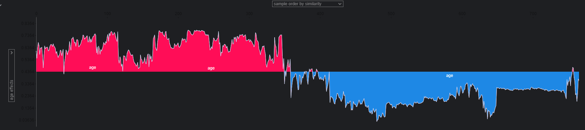

# Interpretability of the model

We will be presenting the 2 models that we had and explain it which features and how it gets to that prediction.

# Interpretability of GNB_001

--------------
### Global predictions
The first thing we try to do its to view the global overview of the model to se how it develops 

In the next chart we could see  that some variables had  some volatility in the prediction meaning that this variable
make the prediction move from one side to another, 

We observed that certain factors increase the likelihood of stroke, such as **age, smoking status (as smoker or unknown), 
hypertension, heart disease, and glucose levels**. Conversely, factors that appear to reduce the risk include **age, 
marital status, and BMI.** Age emerges as a particularly clear variable in predicting stroke probability when the
model interprets these factors.

--------------
### Group predictions

We will be dividing by the positive and negative values how they fail in the predictions

##### Wrong positive predictions

We've observed that age is one of the reasons the model fails to predict accurately. Other factors, such as marital
status (being ever married, which correlates with age) and employment type (like having children, associated 
with younger ages), could also contribute to the model's inaccurate predictions.

##### Wrong negative predictions

This is where we observe numerous miss classifications with the models. However, from the chart, we notice that many 
predictions begin with miss classifications related to age, heart disease, or smoking status. These factors can
significantly impact the predictive accuracy of the model.

##### Grouping predictions for age
In this single feature for **Age**, we observe a clear evolution across certain ranges of values, highlighting distinct zones and
differences. As previously noted, age exhibits the highest variability among these values.

--------------
### Individual predictions
we will extract 2 values of each of the predictions to understand how they predict each value

##### Wrong positive predictions
1. Example:

A significant portion of the predictions rely heavily on age, but this does not consistently improve accuracy. 
Conversely, smoking status tends to reduce the risk. However, the presence of NaN values in the BMI actual data 
may impact our predictions.

2. Example:

It appears that we do not observe any predicted values that increase the probability of stroke. We are particularly 
 lacking age in this context. Additionally, it seems that the predicted values for smoking are consistently absent, 
which could be influencing the outcomes.

##### Wrong negative predictions
1. Example:

We observed an increased risk of stroke associated with being 55 years old and a former smoker. Additionally,
marital status, specifically being married, appeared to influence the model's decision in the background.

2. Example:

In these examples, three factors significantly influence the results: an age of 75, extremely high glucose levels at 206, 
and marital status, which appears to affect the model's decision-making process.

-----------
# Interpretability of GNB_001

--------------
### Global predictions
The first thing we try to do its to view the global overview of the model to se how it develops 

We observed significant variation in age and marital status, as well as in hypertension and heart disease.
These factors appear to contribute to greater predictability.

--------------
### Group predictions

We will be dividing by the positive and negative values how they fail in the predictions

##### Wrong positive predictions

We observed that the same categories impacting the other model also influence this one in predicting the likelihood 
of a stroke. These categories include age, whether the individual is a child or a former smoker, and marital status.

##### Wrong negative predictions

We obser that the age, if they get married or having a heart disease could be the reason to be impacted by the prediction in the models.

##### Grouping predictions for age
It looks like age its giving a lot of the predicting power to the prediction of the variables.

--------------
### Individual predictions
we will extract 2 values of each of the predictions to understand how they predict each value

##### Wrong positive predictions
1. Example:

In the first prediction, the age appears to be around 75, but the row indicates that it is working with children. 
This discrepancy could be the reason we are not getting the correct value.

2. Example:

In this second prediction, we can see that age is the most influential factor. Since the patient is 32 years old,
the model fails to provide an accurate result, indicating a prediction error.

##### Wrong negative predictions
1. Example:

In this case, because the patient is a smoker and is 55 years old, the model predicts a high likelihood of a stroke.

2. Example:

In the last case we analyzed, the glucose levels are very high, around 206, and the patient is 75 years old. 
This is why the model predicted a high likelihood of a stroke.

3. 

# Conclusions
- We observed that **Age** is a significant factor in the predictive model. For future steps, we should consider reducing the impact of this variable to potentially improve performance. 
- Other features, such as **gender** and **residency type**, do not contribute much predictive power to the final results.
- Features like **hypertension** and **heart disease** could enhance predictability if we focus on their individual impact.